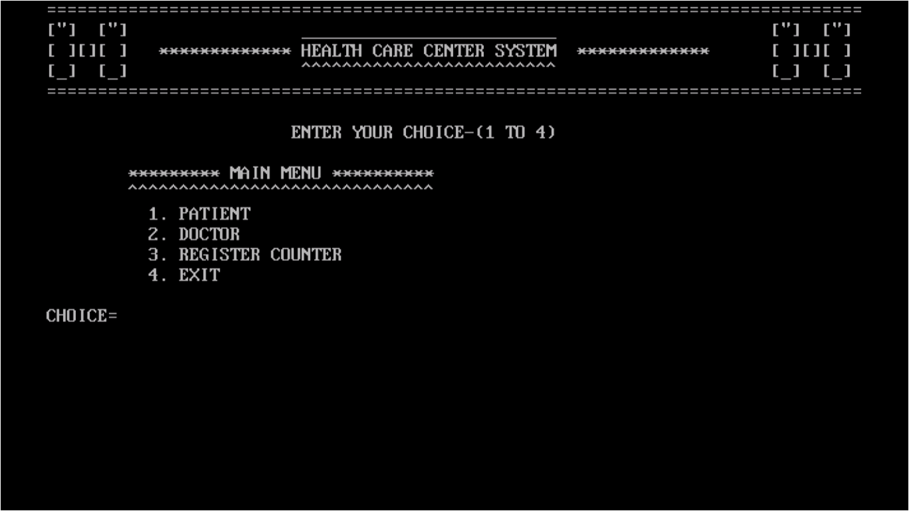
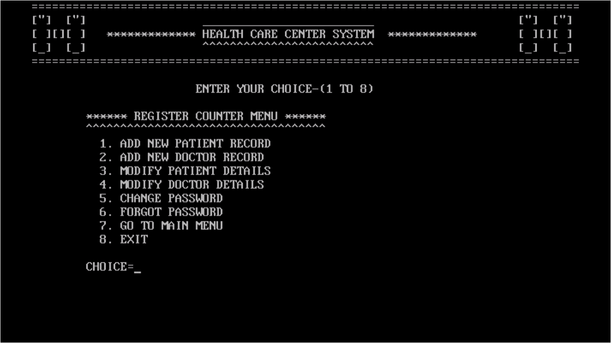
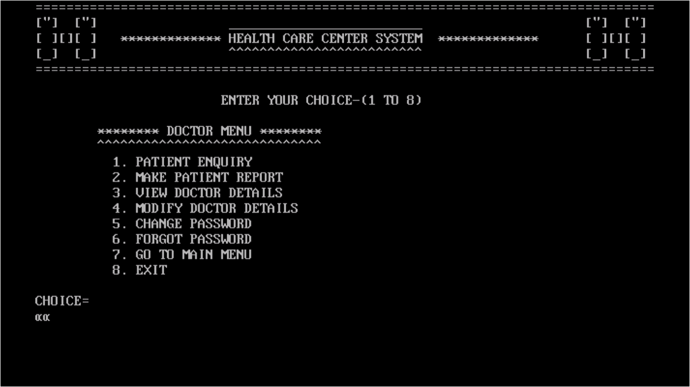
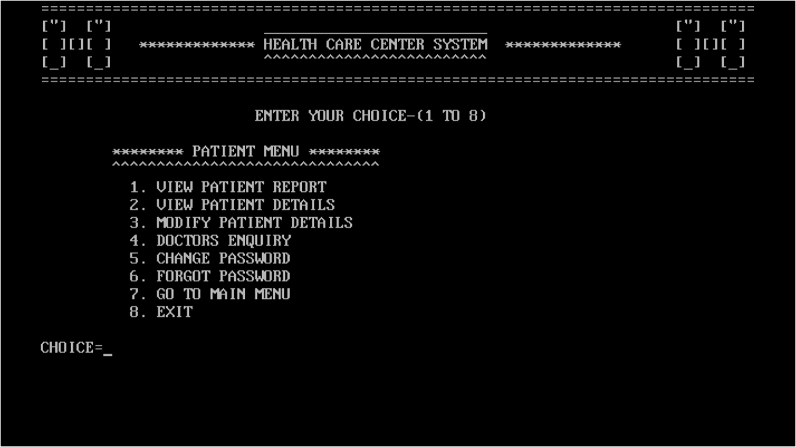

# Healthcare-Management-System-

[Link To Live Project](https://example.com)

***

 

### [C, C++]

1. It is an application program using C,C++ languages for Registration of patients, Storing the details and Maintaining records of patients, doctors in an organized and efficient manner using file handling in which the reports can be easily generated for each patient.

2. Only Admin/registrar have the authorities to add, remove any doctor or patient to management system and can update their records.

## Modules

1. [Admin](#adminFunctions)

2. [Doctor](#docFunctions)

3. [Patient](#patientFunctions)

## Functionalities

***

### Admin Panel

1. Add new patients record. 
2. Add new doctors record. 
3. Modify patients details. 
4. Modify doctors details. 
5. Change password.
6. Forgot password. 

### Doctors Panel

1. Patient Enquiry/Consultation. 

2. Make Patients Report. 

3. View doctor details. 

4. Modify doctor details. 

5. Change password.

6. Forgot password. 

### Patients Panel

1. View patient report. 

2. View patient details. 

3. Modify patients details. 

4. Doctors Enquiry/Details. 

5. Change password.

6. Forgot password. 

